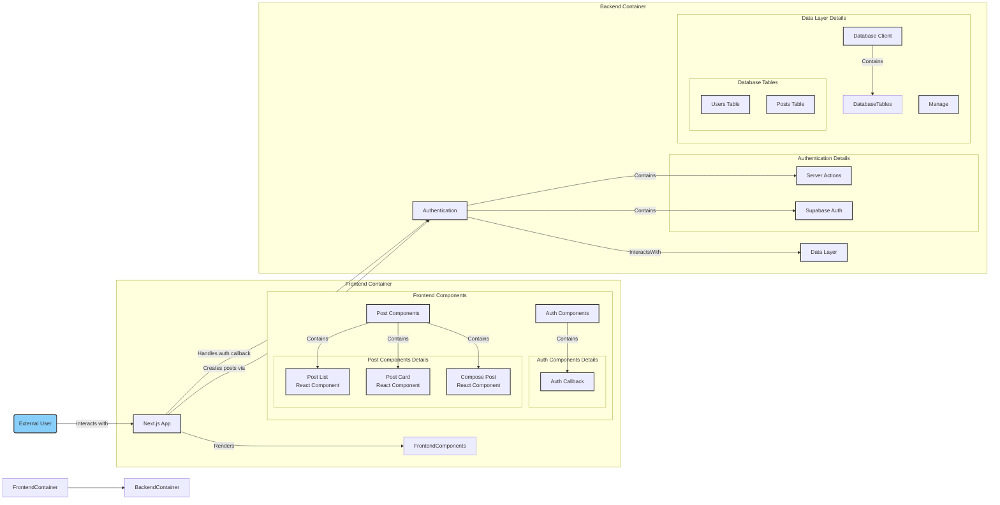

# XJson - Clon de Twitter (X)

[](x-json-kha7.vercel.app/)  
*(Verifica este enlace. ¿Es correcto para *XJson* o debe ser otro?)*

---

## Diagrama de Arquitectura del Proyecto



---

## Descripción

**XJson** es una réplica funcional de la red social Twitter (ahora X), construida con **Next.js** en el frontend y un backend robusto basado en **Supabase**. Este proyecto se centra en la creación de una experiencia de usuario similar a Twitter, implementando funcionalidades clave como:

- **Autenticación de Usuarios:** Registro e inicio de sesión seguros.
- **Gestón de Sesiones:** Manejo eficiente de sesiones de usuario, incluyendo cierre de sesión.
- **Interacción con Publicaciones:** Permite agregar comentarios a los posts.
- **Base de Datos Funcional:** Almacena usuarios, posts y comentarios.

El objetivo es recrear la esencia de Twitter con un enfoque en la funcionalidad y experiencia del usuario.

🔗 **[Demo en Vercel](https://x-json-kha7.vercel.app/)**

---

## 🚀 Inicio Rápido

### 1️⃣ Clonar el repositorio
```bash
git clone <URL_DEL_REPOSITORIO_XJSON>
cd XJson
```

### 2️⃣ Instalar dependencias
```bash
pnpm install  # o yarn install  o npm install
```

### 3️⃣ Configurar variables de entorno
Crea un archivo `.env.local` en la raíz del proyecto y define las variables necesarias.

Ejemplo:
```ini
NEXT_PUBLIC_SUPABASE_URL=tu_url_supabase
NEXT_PUBLIC_SUPABASE_ANON_KEY=tu_anon_key_supabase
# ... otras variables de entorno necesarias ...
```

### 4️⃣ Ejecutar el servidor de desarrollo
```bash
pnpm dev  # o yarn dev  o npm run dev
```

### 5️⃣ Abrir la aplicación en el navegador
Accede a **[http://localhost:3000](http://localhost:3000)**.

---

## 📂 Estructura del Proyecto

```
XJson/
│── src/
│   ├── app/
│   │   ├── page.tsx  # Página principal
│   │   ├── auth.tsx  # Autenticación
│   ├── components/
│   │   ├── AuthComponents.tsx
│   │   ├── PostComponents.tsx
│── public/
│── styles/
│── .env.local.example  # Ejemplo de configuración de variables de entorno
│── README.md  # Este archivo 📄
│── package.json
│── tailwind.config.ts
│── tsconfig.json
```

---

## 📜 Licencia
Este proyecto se encuentra bajo la licencia **MIT**. Puedes usarlo y modificarlo libremente. ✨

